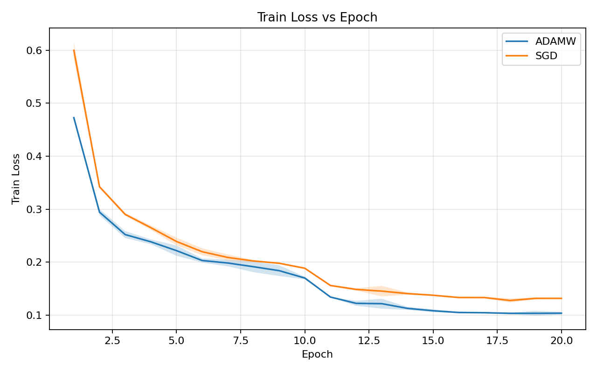
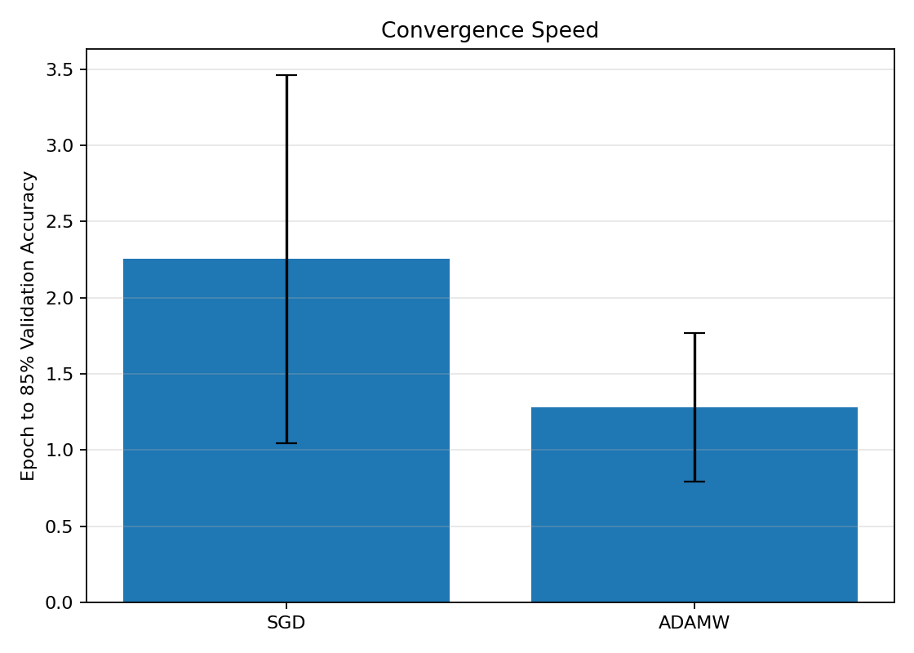
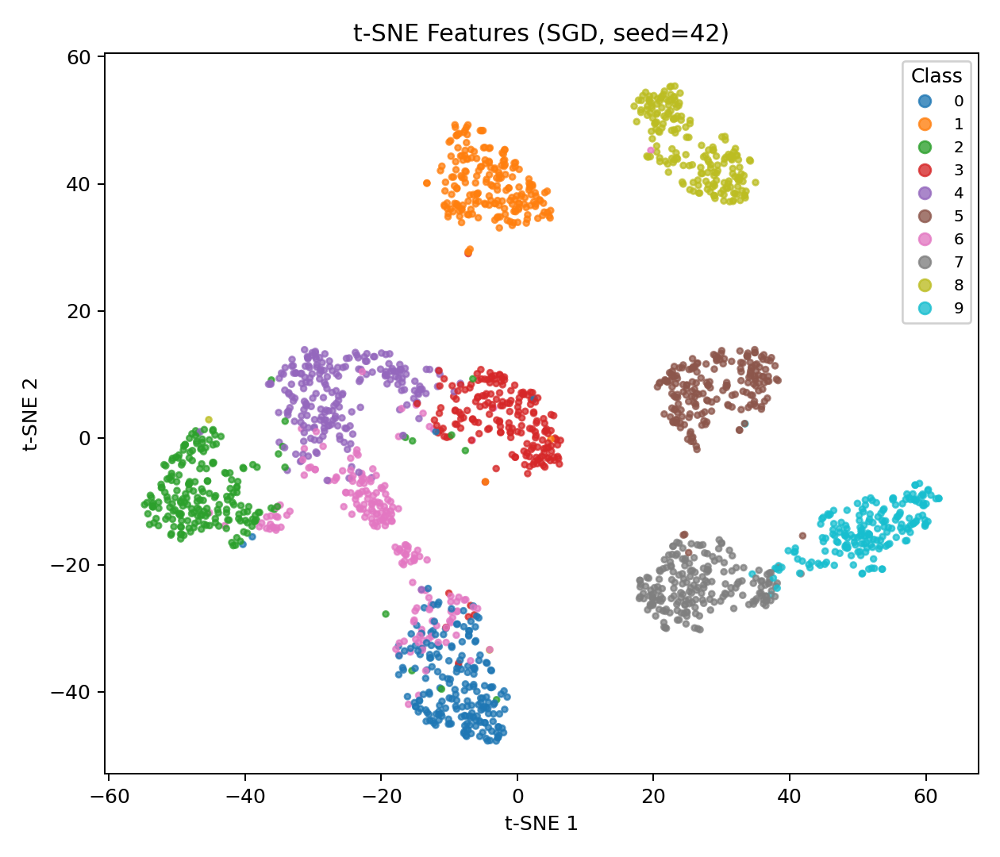
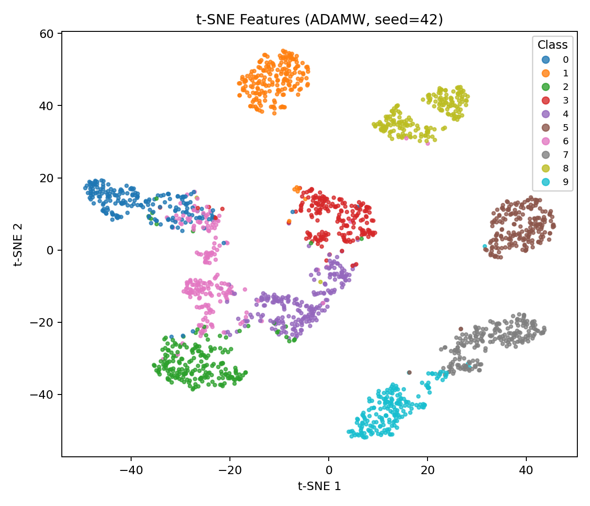

# Optimizer Comparison: SGD vs. AdamW on Fashion-MNIST

## Hypothesis
AdamW converges faster and achieves higher validation accuracy than SGD.

## Primary Endpoint
Final validation accuracy at epoch 20.

## Summary Table

| Optimizer | Best Val Acc (%) | Final Val Acc (%) | Epoch to 85% |
|-----------|------------------|-------------------|--------------|
| SGD | 93.790 +/- 0.035 | 93.720 +/- 0.108 | 2.253 +/- 1.207 |
| AdamW | 94.467 +/- 0.101 | 94.430 +/- 0.062 | 1.282 +/- 0.488 |

## Statistical Test
- Normality check (Shapiro-Wilk):
  - SGD p-value: 0.537
  - AdamW p-value: 0.463
- Test used: independent_ttest
- p-value: 0.002
- t-statistic: 9.846
- U-statistic: n/a
- Cohen's d (AdamW - SGD): 8.039 (large)
- 95% CI of mean difference (AdamW - SGD): [0.569, 0.851]

## Convergence
AdamW reaches 85% validation accuracy 0.971 epochs earlier than SGD (negative means slower).

## Figures
- 
- 
- 
- 
- 

## Notes
- This comparison uses Fashion-MNIST test split as evaluation split.
- t-SNE is qualitative and can vary with hyperparameters.
